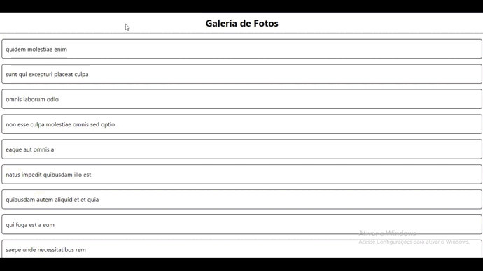
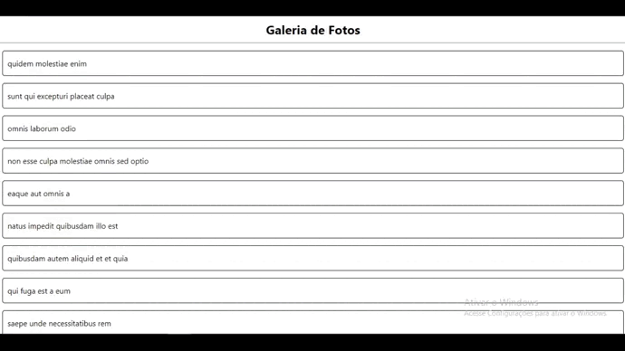
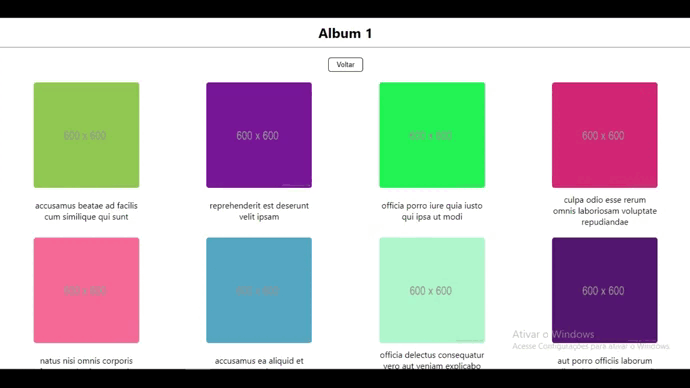

# Photo Album Consuming API

## | About

This is a project where I focused mainly on consuming an API.

## | Overview

## | Albums List

Each album has different photos in it.

## | Photos List

## | Loading Screen

While waiting for the API informations, this is what will be displayed :

## | Made Using
<ul>
<li>ReactJS</li>
<li>Typescript</li>
<li>Styled-Components</li>
<li>API</li>
<li>Axios</li>
<li>React Router</li>
</ul>

## | How to Run

Make sure "Git" is installed in your PC!

    git clone https://github.com/Bruno-Messias-B-S/Photo-Album.git

### Install
- `npm install`

### To run
- `npm run dev`

## | Made By
[Bruno Messias](https://www.linkedin.com/in/bruno-messias-bs/)
